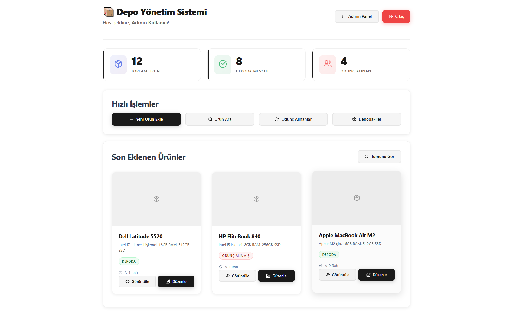
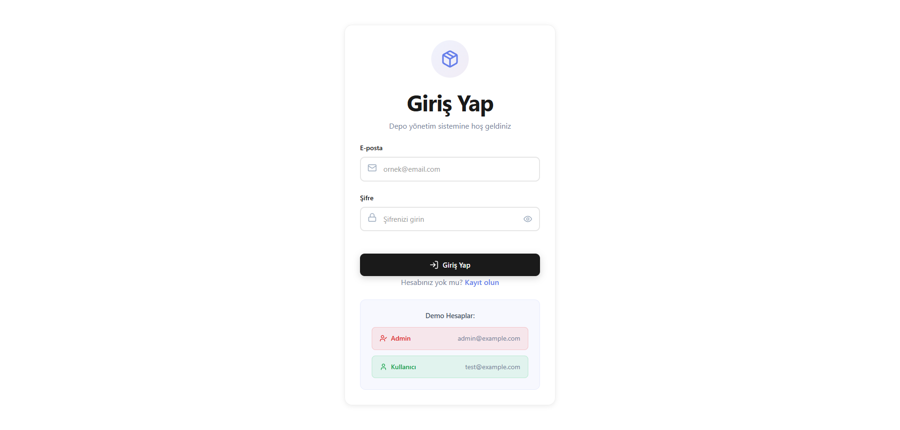
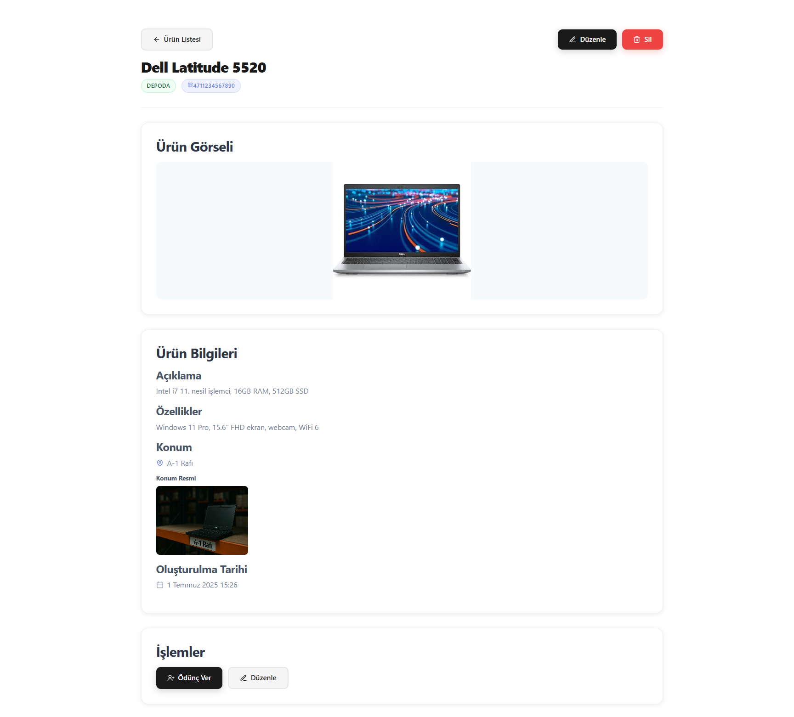
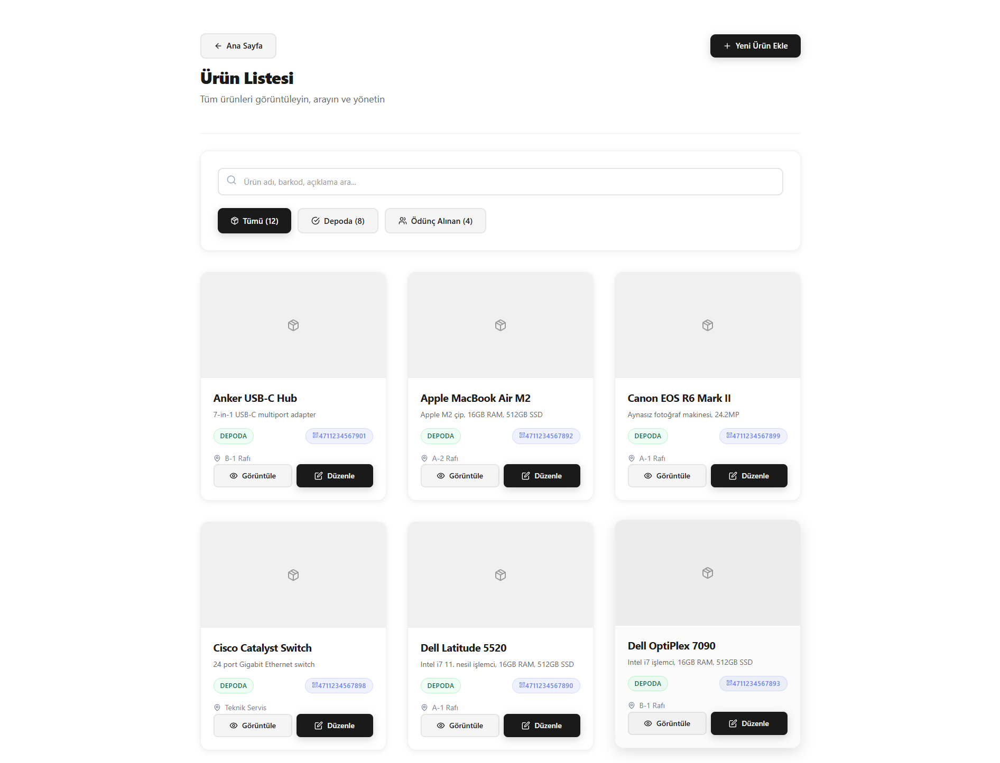
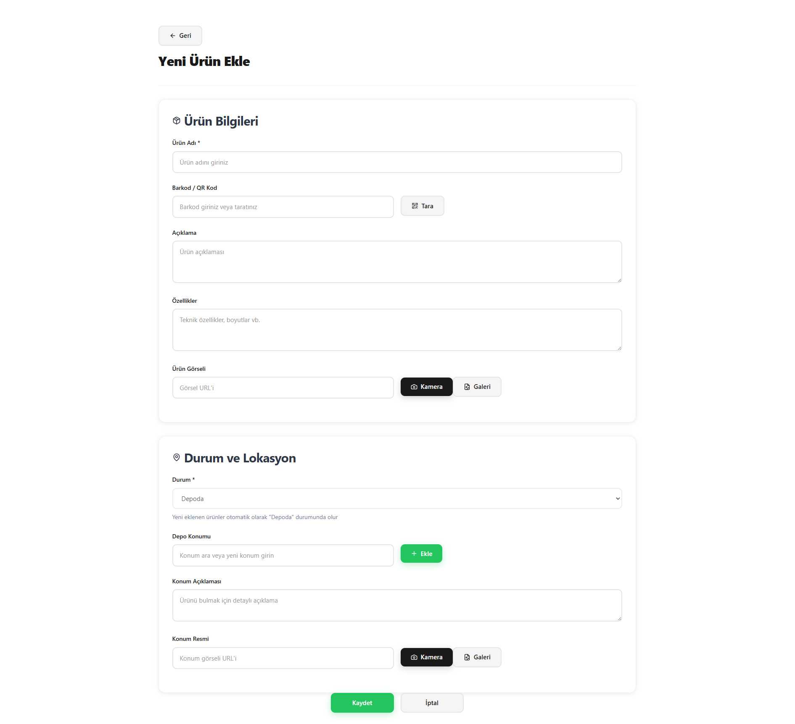
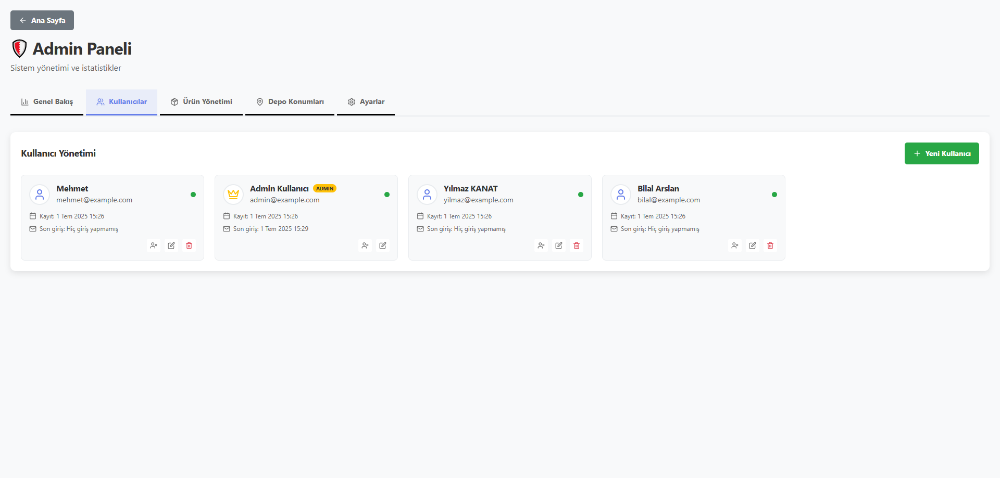
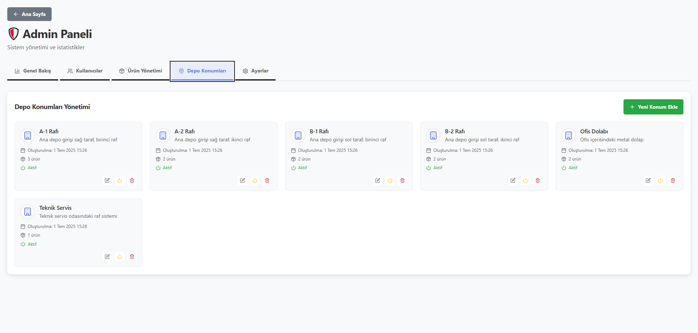

# Depo Takip Uygulaması 

Bu proje, Node.js (Express) tabanlı bir backend ve React (Vite) tabanlı bir frontend ile geliştirilmiş, MySQL veritabanı kullanan bir depo/stok takip uygulamasıdır. Kullanıcı yönetimi, ürün ekleme, barkod ile ürün arama, resim yükleme ve admin paneli gibi özellikler sunar.


<p align="center">
  
</p>

## Özellikler
- Kullanıcı kayıt ve giriş sistemi (JWT ile güvenli kimlik doğrulama)
- Admin ve normal kullanıcı rolleri
- Ürün ekleme, silme, güncelleme ve detay görüntüleme
- Barkod ile ürün arama ve ekleme
- Ürünlere resim yükleyebilme
- Depo/konum yönetimi
- Modern ve hızlı React arayüzü
- Responsive tasarım
- MySQL veritabanı ile tam entegre

---

## Kurulum ve Çalıştırma

### Gereksinimler
- Node.js (v18+ önerilir)
- npm
- MySQL sunucusu

### 1. Projeyi Klonlayın
```bash
git clone https://github.com/ylmazkanat/Depo-Takip-Uygulamasi.git
cd Depo-Takip-Uygulamasi
```

### 2. Ortak Bağımlılıkları Yükleyin
```bash
npm run install-all
```


### 3. Ortam Değişkenleri ve Veritabanı Ayarları
- `server/.env.example` dosyasını kopyalayarak `server/.env` dosyasını oluşturun.
- `.env` dosyasındaki MySQL bağlantı ayarlarını (DB_HOST, DB_USER, DB_PASSWORD, DB_NAME, DB_PORT) kendi veritabanınıza göre güncelleyin.
- Gerekirse bir MySQL veritabanı oluşturun.

- `frontend/.env.example` dosyasını kopyalayarak `frontend/.env` dosyasını oluşturun.
- Gerekirse API adresi ve diğer ayarları kendi ortamınıza göre güncelleyin (örn. VITE_API_BASE_URL, VITE_API_BASE_URL_PRODUCTION).

### 4. Veritabanı Kurulumu (Tablolar ve Örnek Veriler)
```bash
npm run migrate   # Tüm tabloları oluşturur ve örnek verileri ekler
```

### 5. Uygulamayı Başlatın
```bash
npm run dev
```
- Bu komut ile hem backend (Express API) hem de frontend (React) aynı anda başlar.
- Frontend genellikle `http://localhost:5173` adresinde, backend ise `http://localhost:3001` adresinde çalışır.

### 6. Giriş Bilgileri (Varsayılan)
- Admin kullanıcı: 
  - Email: `admin@example.com`
  - Şifre: `admin123`
- Normal kullanıcı: 
  - Email: `user@example.com`
  - Şifre: `user123`

---

## Komutlar
| Komut                | Açıklama                                      |
|----------------------|-----------------------------------------------|
| npm run dev          | Hem backend hem frontend'i başlatır           |
| npm run frontend:dev | Sadece frontend'i başlatır                    |
| npm run server:dev   | Sadece backend'i başlatır                     |
| npm run migrate      | Veritabanı tablolarını oluşturur              |
| npm run seed         | Örnek verileri ekler                          |
| npm run reset-db     | Veritabanını sıfırlar ve tekrar kurar         |
| npm run build        | Frontend'i production için derler             |

---

## Klasör Yapısı
```
Depo-Takip-Uygulaması/
├── frontend/      # React (Vite) arayüzü
├── server/        # Express.js API ve veritabanı
├── package.json   # Ana scriptler ve bağımlılıklar
```

---

---

## Uygulama Görselleri

<details>
<summary>Giriş Ekranı</summary>


</details>


<details>
<summary>Panel Görünümü</summary>


</details>
<details>
<summary>Ürün İç Sayfası</summary>


</details>

<details>
<summary>Ürün Arama</summary>


</details>

<details>
<summary>Ürün Ekleme</summary>


</details>


<details>
<summary>Admin Kullanıcı Yönetimi</summary>


</details>

<details>
<summary>Admin Raf Yönetimi</summary>


</details>


---
- Katkıda bulunmak için fork'layıp PR gönderebilirsiniz.
- MIT Lisansı ile lisanslanmıştır.

---

## İletişim
Her türlü soru ve öneriniz için lütfen GitHub Issues bölümünü kullanın.
